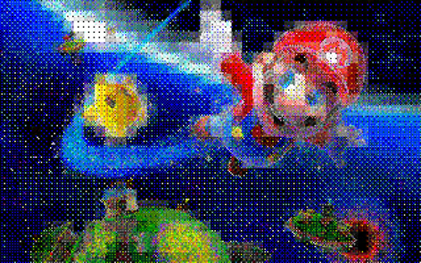

# BMP file to .z25 Converter

## Project Description

The subject of this project is the creation of a specification for a raster graphic file and an application that allows for the conversion of `.bmp` files to a custom graphic format `.z25`, and from the custom `.z25` file format back to `.bmp`.

The application allows for customization of the conversion process through the following options:

* **Saving Mode Selection:**
    * RGB565
    * RGB888
    * YCbCr888
* **Color Mode Selection:**
    * Color
    * Grayscale
* **Dithering Selection:**
    * No dithering
    * Dithering with the Bayer matrix
* **Compression Type Selection:**
    * Lossless (LZW)
    * Lossy (DCT transform)
    * None
* **Prediction Algorithm Selection:**
    * None
    * Type 1 Prediction
* **Chroma Subsampling Application? (Only for YCbCr)**
    * No
    * Yes

The application enables any configuration of the described modes, with the following exceptions:
* The prediction algorithm is not available when lossy compression is selected.
* Chroma subsampling is only available when the YCbCr saving mode is chosen.

## .z25 File Format Specification

The header of `.z25` files is used to identify the file and to read metadata about the image. The header elements and their meaning are placed in the table below:

| Name               | Offset (bytes) | Size (bytes) | Values and Purpose                                          |
|--------------------|----------------|--------------|-------------------------------------------------------------|
| Identifier         | 00             | 2            | `"KW"` – serves to identify the file                        |
| Image Width        | 02             | 2            | Specifies the width of the image                             |
| Image Height       | 04             | 2            | Specifies the height of the image                            |
| Saving Mode        | 06             | 1            | Values: 1-3 (1 – RGB565, 2 – RGB888, 3 – YCbCr888)           |
| Color Mode         | 07             | 1            | Values: 0-1 (0 – Color, 1 – Grayscale)                       |
| Dithering          | 08             | 1            | Values: 0-1 (0 – No dithering, 1 – Dithering with Bayer)    |
| Prediction Alg.    | 09             | 1            | Values: 0-1 (0 – None, 1 – Type 1 Prediction)              |
| Compression Type   | 10             | 1            | Values: 0-2 (0 – Lossless, 1 – Lossy, 2 – No Compression) |

---
## Examples

### Image before conversion

### RGB565, dithering with Bayer matrix, lossless compression, Type 1 prediction

### RGB888, no dithering, lossy compression

### YCbCr888, dithering with Bayer matrix, lossy compression, 420 chroma subsampling

